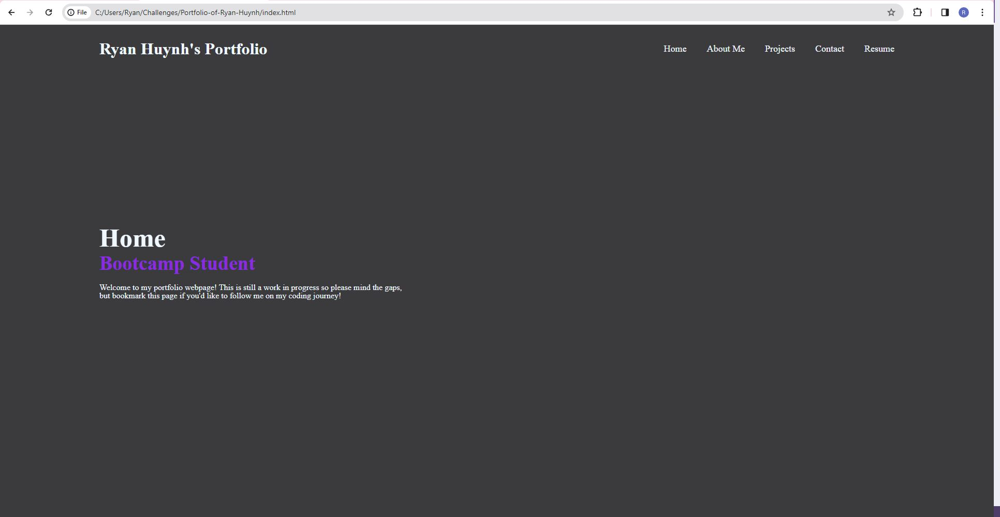

# Challenge 2

## Description

This is the the second challenge for the class. For this challenge, we will be creating a mock-up
of our potential portfolio webpage. For this challenge, I wanted to add elements of a webpage that 
suits my character, so check it out and see the colors and styles that fit my type of work!

## User Story

AS AN employer
I WANT to view a potential employee's deployed portfolio of work samples
SO THAT I can review samples of their work and assess whether they're a good candidate for an open position

## Acceptance Criteria

GIVEN I need to sample a potential employee's previous work
WHEN I load their portfolio
THEN I am presented with the developer's name, a recent photo or avatar, and links to sections about them, their work, and how to contact them
WHEN I click one of the links in the navigation
THEN the UI scrolls to the corresponding section
WHEN I click on the link to the section about their work
THEN the UI scrolls to a section with titled images of the developer's applications
WHEN I am presented with the developer's first application
THEN that application's image should be larger in size than the others
WHEN I click on the images of the applications
THEN I am taken to that deployed application
WHEN I resize the page or view the site on various screens and devices
THEN I am presented with a responsive layout that adapts to my viewport

## Mock Up

This is what the overall webpage will look like. We will continue to work on the webpage over the course of the bootcamp!

[Take a look!](https://ryanhuynh006.github.io/Portfolio-of-Ryan-Huynh/)

## Conclusion

We have now set up a personal webpage displaying our portfolio! This wepage will be a history log of our progression over the course of this bootcamp! 
